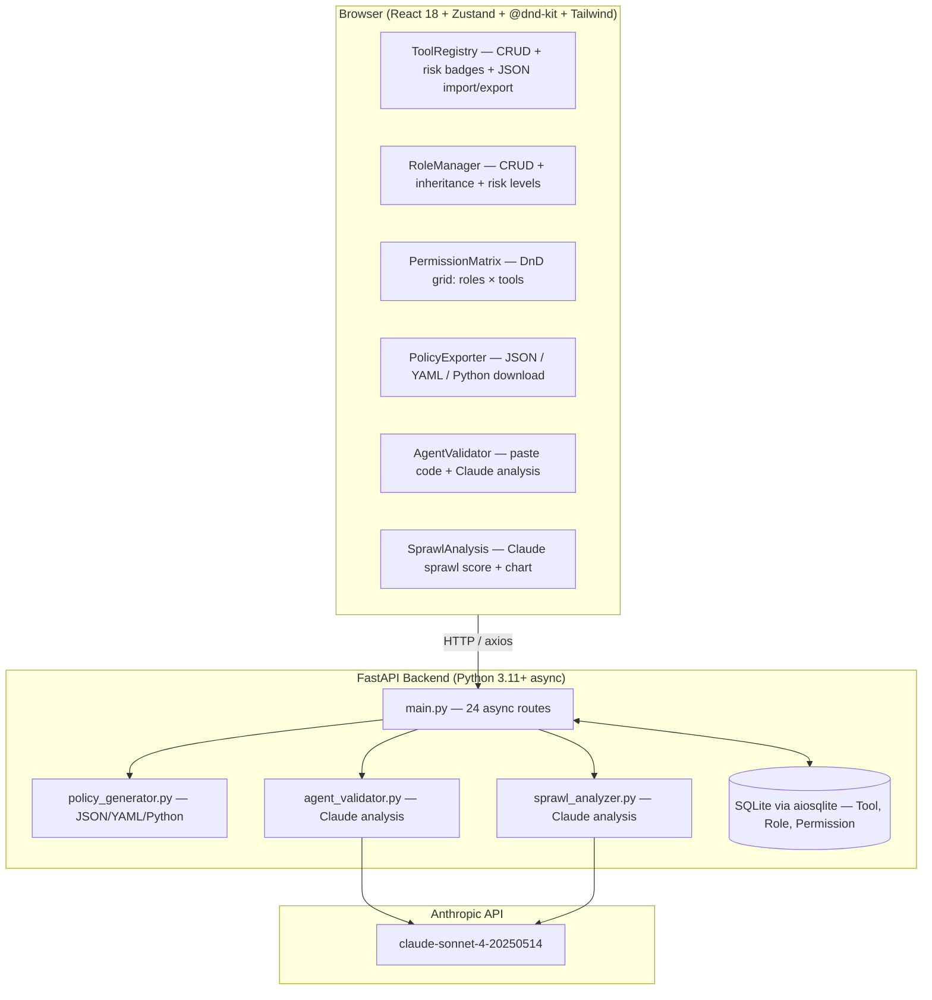

# Tool Permission Matrix Builder & Validator

> Built autonomously using **[NEO](https://heyneo.com)** — Your Autonomous AI Engineering Agent
>
> [](https://marketplace.visualstudio.com/items?itemName=NeoResearchInc.heyneo)  [](https://marketplace.cursorapi.com/items/?itemName=NeoResearchInc.heyneo)  [](https://docs.heyneo.com/neo-mcp)
>
> [](https://vscode.dev/)
> [](https://cursor.sh/)

A visual policy management system for AI agent teams. Define your tools, classify their risk, assign roles, and drag-and-drop permissions onto a matrix — then export machine-readable policy artifacts or validate your existing agents for compliance, all powered by Claude claude-sonnet-4-20250514.

---

## What This Platform Does

AI agents in production access tools that range from harmless read-only queries to irreversible destructive operations. Managing which agents can use which tools is a governance problem that most teams solve with ad-hoc scripts and tribal knowledge. This platform replaces that with a structured, visual approach.

You start by registering your tools and classifying each by risk: read-only, internal-write, external-api, financial, destructive, or administrative. You create roles for your agent types — analyst, operator, admin, readonly-bot, and so on. Then the permission matrix lets you drag tools onto roles or click individual cells to toggle allowed/denied/inherited. The matrix validates in real time: if a role has access to a tool whose risk level exceeds what that role should have, a warning appears immediately.

Once the matrix looks right, you export a policy artifact: JSON for machine consumption, YAML for GitOps workflows, or a Python module with a `check_permission(role, tool)` function you can import directly into your agent code. You can also paste in an existing agent's code and let Claude analyze which tools it actually calls, cross-check against the matrix, and produce a security score with sorted recommendations. A separate sprawl analysis detects over-exposure: roles with too many high-risk tools, tools granted to too many roles, and unused grants.

---

## Architecture



The backend is fully async — all 24 routes use `async def` with an `aiosqlite`-backed SQLAlchemy session. This matters for the Claude-powered services: agent validation and sprawl analysis call the Anthropic API without blocking the event loop, so many users can trigger analysis concurrently.

Both AI services have heuristic fallbacks. If `ANTHROPIC_API_KEY` is not set, the agent validator still extracts tool call patterns from the code using regex and checks them against the matrix, and the sprawl analyzer still computes numerical sprawl metrics. The Claude path produces richer narrative and nuanced recommendations; the heuristic path still provides actionable data.

The policy generator produces three output formats from the same matrix data. The Python module output is syntax-verified via `py_compile` before being returned, ensuring the downloaded file is always importable.

---

## Prerequisites

- Python 3.11 or newer
- Node.js 18 or newer
- An Anthropic API key (optional — Claude features fall back to heuristic analysis without it)

---

## Getting Started

### Set Up the Environment

```bash
cp .env.example .env
# Optionally add ANTHROPIC_API_KEY=sk-ant-your-key-here for Claude analysis
```

### Run the Backend

```bash
cd backend
pip install -r requirements.txt
uvicorn main:app --reload --host 0.0.0.0 --port 8000
```

API starts at `http://localhost:8000`. Swagger UI at `http://localhost:8000/docs`.

### Run the Frontend

Open a second terminal:

```bash
cd frontend
npm install
npm run dev
```

UI opens at `http://localhost:5173`.

### Run with Docker

```bash
cp .env.example .env
docker compose up --build
```

Backend runs on port 8000 with a health check. Frontend serves via nginx on port 80, and will wait for the backend health check before starting.

---

## Running Tests

```bash
cd backend && python -m pytest tests/ -v
```

22 tests — policy generation (JSON/YAML/Python), agent validator, heuristic analysis. Runs in under a second.

---

## API Reference

| Method | Path | What it does |
|--------|------|--------------|
| GET/POST | `/api/tools` | List or create tools |
| GET/PUT/DELETE | `/api/tools/{id}` | Read, update, or delete a tool |
| GET/POST | `/api/roles` | List or create roles |
| GET/PUT/DELETE | `/api/roles/{id}` | Read, update, or delete a role |
| GET/POST | `/api/permissions` | List or create permissions |
| GET/PUT/DELETE | `/api/permissions/{id}` | Read, update, or delete a permission |
| GET | `/api/matrix` | Full permission matrix (all roles × tools) |
| POST | `/api/policy/generate` | Generate JSON, YAML, or Python policy |
| POST | `/api/validate` | Claude-powered agent code validation |
| POST | `/api/sprawl/analysis` | Claude-powered sprawl analysis |
| GET | `/api/health` | Health check |

---

## Risk Categories

All six risk categories are implemented as a Python Enum and stored in the database:

| Category | Color | Description |
|----------|-------|-------------|
| `read-only` | Green | Read/query data, no mutations |
| `internal-write` | Yellow | Modify internal state or files |
| `external-api` | Orange | Call external APIs or services |
| `financial` | Red | Handle money, payments, or financial data |
| `destructive` | Red | Delete or overwrite data irreversibly |
| `administrative` | Red | Modify system configuration or permissions |

The permission matrix UI shows these risk colors on every tool badge, and the real-time validation warnings fire when a role's allowed risk levels would be exceeded.

---

## Project Structure

```
tool-permission-matrix/
├── backend/
│   ├── main.py                        # FastAPI app, 24 async routes
│   ├── models.py                      # Tool, Role, Permission ORM + RiskCategory Enum
│   ├── schemas.py                     # Pydantic v2 request/response schemas
│   ├── database.py                    # Async SQLite via aiosqlite
│   ├── services/
│   │   ├── policy_generator.py        # JSON, YAML, and Python module export
│   │   ├── agent_validator.py         # Claude + heuristic agent code analysis
│   │   └── sprawl_analyzer.py        # Claude + heuristic sprawl detection
│   ├── requirements.txt
│   ├── Dockerfile.backend
│   └── tests/
│       ├── test_policy_generator.py   # 11 policy generation tests
│       ├── test_validator.py          # 11 validator tests
│       └── fixtures/
│           ├── sample_agent.py        # Realistic agent with tool call patterns
│           └── sample_policy.json     # Realistic permission matrix fixture
├── frontend/
│   ├── src/
│   │   ├── App.tsx                    # Tab layout: Tools/Roles/Matrix/Export/Validate/Sprawl
│   │   ├── stores/
│   │   │   ├── toolStore.ts           # Zustand store for tool state
│   │   │   ├── roleStore.ts           # Zustand store for role state
│   │   │   └── matrixStore.ts         # Zustand store for permission matrix
│   │   ├── components/
│   │   │   ├── ToolRegistry.tsx       # CRUD + filter + JSON import/export
│   │   │   ├── RoleManager.tsx        # CRUD + inheritance + risk levels
│   │   │   ├── PermissionMatrix.tsx   # @dnd-kit DnD grid
│   │   │   ├── PolicyExporter.tsx     # Format selector + download
│   │   │   ├── AgentValidator.tsx     # Paste/upload + results display
│   │   │   └── SprawlAnalysis.tsx     # Sprawl score + issues list
│   │   ├── api/client.ts              # axios-based API client, 20 methods
│   │   └── types/index.ts             # TypeScript interfaces (28 types)
│   ├── Dockerfile.frontend
│   ├── package.json
│   └── vite.config.ts
├── docker-compose.yml
└── .env.example
```

---

## Key Design Decisions

**Async throughout** — All backend routes are `async def` and the SQLAlchemy session uses `aiosqlite`. This is intentional: the Claude API calls in agent validation and sprawl analysis can take 5–15 seconds. With a synchronous backend, one validation request would block all other users. With async, many concurrent requests are handled without blocking.

**Three-state permission model** — Each matrix cell is ALLOWED, DENIED, or INHERITED (not just allowed/denied). INHERITED means the permission comes from the role's parent role. This enables role hierarchies where a base role defines conservative defaults and derived roles override specific tools.

**Heuristic fallback for AI features** — Claude-powered features are never the only path. The agent validator extracts tool calls using regex patterns that cover the most common calling conventions, then checks them against the matrix. The sprawl analyzer computes over-exposure metrics numerically. This means the platform is useful in restricted environments without API access, and Claude's analysis is an enhancement rather than a dependency.

**Policy Python module verification** — When generating a Python module, `py_compile` is called on the output before returning it. A permissions.py that fails to compile would be worse than no policy at all, so this check runs as a hard gate.

---

## Environment Variables

| Variable | Required | Default | Description |
|----------|----------|---------|-------------|
| `ANTHROPIC_API_KEY` | No | — | Enables Claude-powered validation and sprawl analysis |
| `BACKEND_HOST` | No | `0.0.0.0` | Backend bind address |
| `BACKEND_PORT` | No | `8000` | Backend port |
| `BACKEND_DATABASE_URL` | No | `sqlite+aiosqlite:///./tool_permission.db` | Database path |
| `CORS_ORIGINS` | No | `http://localhost:5173,...` | Allowed CORS origins |
| `VITE_API_BASE_URL` | No | `http://localhost:8000` | Frontend API base |

---

## Verified Results

The backend ships with 22 tests covering policy generation in all three export formats (JSON, YAML, Python module), agent validator tool-call extraction across standard and `use_tool`/`call_tool` calling conventions, heuristic analysis correctness, and edge cases like empty code and missing policy. The frontend builds cleanly to a 277 KB JS bundle across 110 modules with @dnd-kit drag-and-drop and Zustand state management.

**AI-powered sprawl analysis (DeepSeek V4 Flash via OpenRouter):** We ran the `SprawlAnalyzer` against a three-role matrix (admin, developer, viewer) with six tools spanning read, write, and destructive categories. The model returned a **sprawl score of 80/100** and surfaced nine issues. Two were critical — the admin role holding both `execute_code` and `delete_resource`, and the developer role also having `execute_code` with no approval gate. The overall analysis named the pattern as excessive concentration of destructive tool access and recommended introducing approval workflows before any destructive operation.